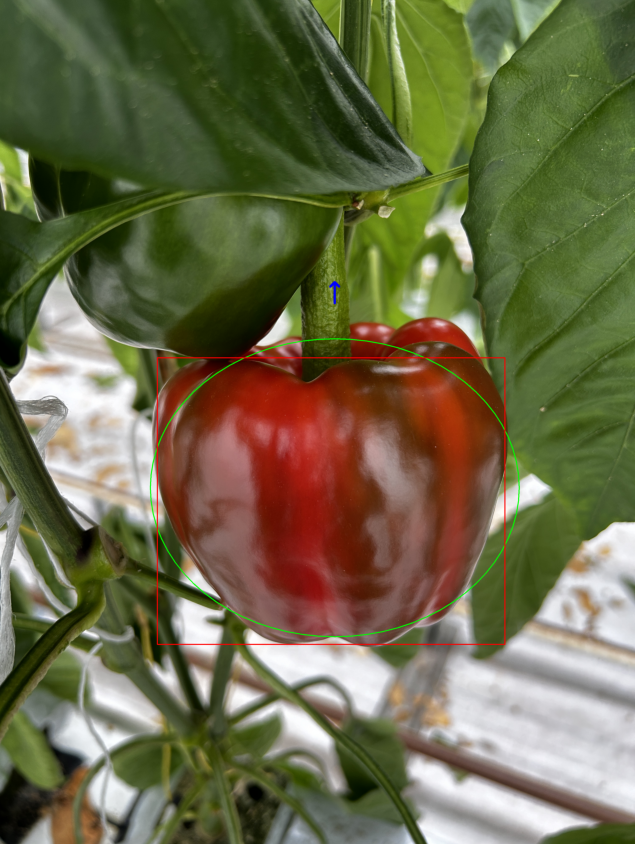

# Bell Pepper Pose Estimation using YOLOv8 Segmentation

Due to the complexity of 3D pose estimation, a different approach was adopted for determining the pose of bell peppers. This method leverages a pre-trained YOLOv8 segmentation model along with computer vision techniques to accurately identify the orientation and spatial position of the bell peppers.

## Method Overview

### 1. Object Detection and Segmentation

A YOLOv8 segmentation model, pre-trained on a specific dataset, is utilized to detect and segment objects within an image. When an image containing bell peppers is processed, the YOLOv8 model runs inference to identify objects and generate segmentation masks that outline the contours of these objects.

### 2. Contour Extraction

For each detected object:
- The contour is extracted.
- A binary mask is created to facilitate further processing.

### 3. Identifying the Bell Pepper

Among the detected objects, the largest contour, assumed to be the bell pepper, is identified. An ellipse is then fitted to approximate its shape. The minimum enclosing rotated rectangle (bounding box) is calculated to provide the center, size, and angle of the bell pepper. Additionally, the peduncle (stem) is identified and marked to visualize the orientation.

## Code usage
to utilize the code that will create this images specified below run the following

```sh
python pose_estimation.py --model_path path/to/model.pt --image_path path/to/TestImages/image.jpg
```
- `--model_path`: Path to the segmentation model.
- `--image_path`: Path to the image file.

## Conclusion

This method combines object detection with contour analysis to accurately estimate the pose of bell peppers. The annotated image resulting from this process is shown in Figure 1.

<div align="center">

</div>