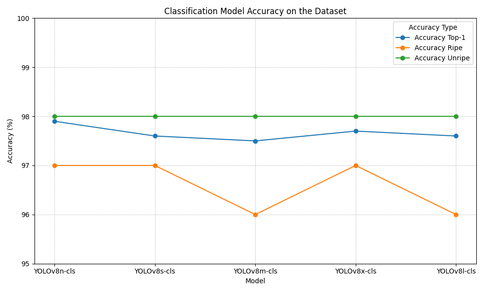
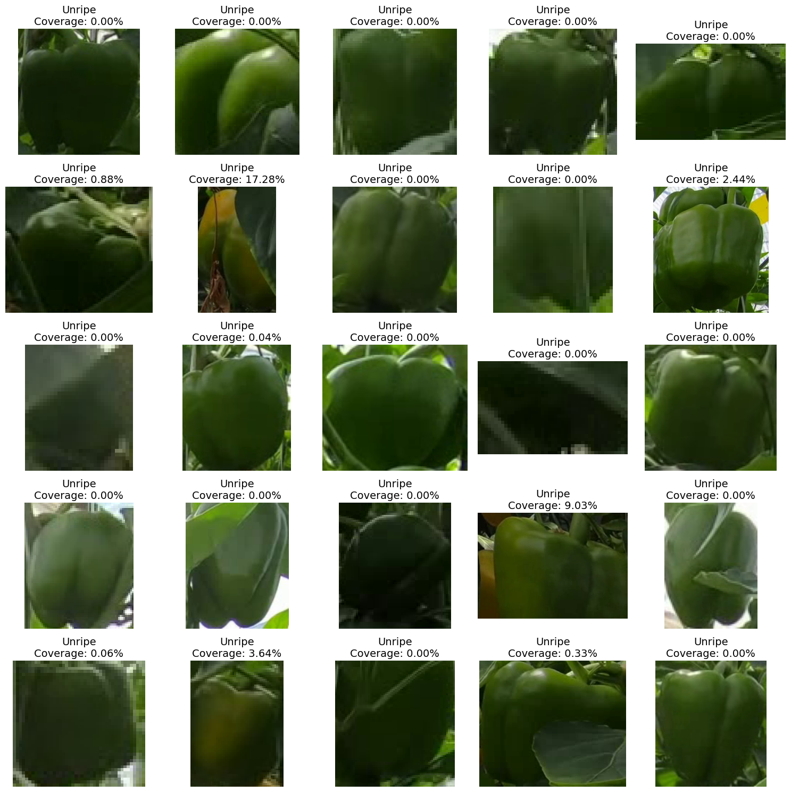

# Ripeness Determination Using YOLOv8 Models

## Overview
This project explores the use of YOLOv8 models for determining the ripeness of bell peppers. Two approaches are investigated:
1. **Ripeness Classification**: Using YOLOv8 models to classify bell peppers as ripe or unripe based on the segmentation model dataset.
2. **Ripeness RGB**: Developing an algorithm to assess ripeness based on RGB values of the fruit.

## Ripeness Classification
This approach leverages YOLOv8 models to determine fruit ripeness. The models are trained on a dataset split into two classes, ripe and unripe. Here are the details on model performance and setup:

### Model Performance
| Model        | Accuracy Top-1 | Accuracy Ripe | Accuracy Unripe |
|--------------|----------------|---------------|-----------------|
| YOLOv8n-cls  | 97.9%          | 97%           | 98%             |
| YOLOv8s-cls  | 97.6%          | 97%           | 98%             |
| YOLOv8m-cls  | 97.5%          | 96%           | 98%             |
| YOLOv8l-cls  | 97.7%          | 97%           | 98%             |
| YOLOv8x-cls  | 97.6%          | 96%           | 98%             |

Training Parameters:
- Batch size = 32
- Image size = 224
- Patience = 100

## Ripeness RGB
An alternative method based on color analysis of the bell peppers. The RGB approach uses a segmentation network to determine ripeness:

### Algorithm Performance
| Model        | Ripe Classification | Unripe Classification |
|--------------|---------------------|-----------------------|
| Set 1        | 97.16%              | 98.27%                |
| Set 2        | 99.39%              | 97.11%                |
| Set 3        | 95.96%              | 68.20%                |
| Set 4        | 100.00%             | 91.75%                |
| All Sets     | 98.35%              | 85.39%                |

## Conclusion
While the classification model provides robust results across varying lighting conditions, the RGB method achieves perfect results under consistent lighting. The comparison highlights the strengths and limitations of each approach, guiding future enhancements and implementations.

---
For more details, please refer to the specific sections and tables within the project documentation.
