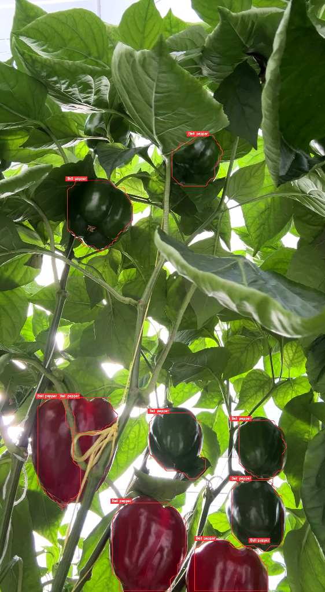
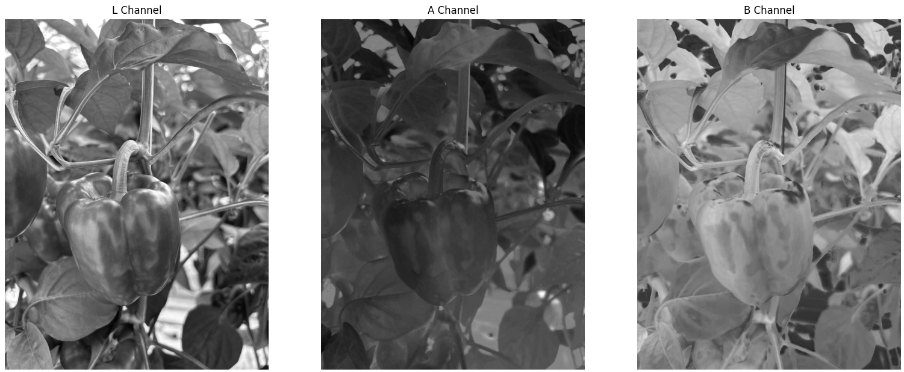
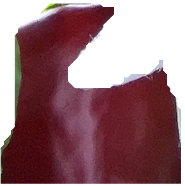

# Bell Pepper Pose Estimation and Detection

This repository contains scripts for detecting, segmenting, and estimating the pose of bell peppers using YOLOv8 and various image processing techniques.

## Prerequisites

- Python 3.6 or higher
- OpenCV
- NumPy
- Matplotlib
- Ultralytics YOLOv8

You can install the required packages using pip:

```sh
pip install opencv-python-headless numpy matplotlib ultralytics
```

## Scripts Overview

### 1. Detection.py

This script performs object segmentation on a video using a YOLOv8 segmentation model.

#### Usage

```sh
python Detection.py --model_path path/to/yolov8n-seg.pt --video_path path/to/video/file.mp4 --output_path path/to/output/video.avi
```

#### Arguments

- `--input_video`: Path to the input video file.
- `--cls_model`: Path to the classification model.
- `--seg_model`: Path to the segmentation model.
- `--output_video`: Path to save the output video file.

example:
<div align="center">
  
</div>

### 2. HSV_Transformation.py

This script transforms an image to the LAB color space and applies segmentation to isolate green bell peppers.

#### Usage

```sh
python HSV_Transformation.py --image_path path/to/image.jpg --output_dir path/to/output/directory --threshold 130
```

#### Arguments

- `--input_video`: Path to the input video file.
- `--cls_model`: Path to the classification model.
- `--seg_model`: Path to the segmentation model.
- `--output_video`: Path to save the output video file.

Example:
<div align="center">

</div>

### 3. NN_Detections.py

This script demonstrates how to perform object segmentation and classification on a video using YOLOv8. This script was used to create the classify dataset.

#### Usage

```sh
python NN_Detections.py --model_path path/to/best.pt --video_path path/to/video.mov --output_dir path/to/output/directory
```
#### Arguments

- `--input_video`: Path to the input video file.
- `--cls_model`: Path to the classification model.
- `--seg_model`: Path to the segmentation model.
- `--output_video`: Path to save the output video file.

Example:
<div align="center">

</div>

## Performance Comparison

For the detections of the systems, several models were tested to evaluate their performance:

| Model       | Box Precision | Accuracy | mAP50 |
|-------------|---------------|----------|-------|
| YOLOV5-seg  | 62.8%         | 50.0%    |  -    |
| YOLOV8-seg  | 63.0%         | 51.5%    |  -    |
| YOLOV9-seg  | 54.1%         | 53.7%    |  -    |
| GELAN-seg   | 71.6%         | 53.2%    |  -    |

---
