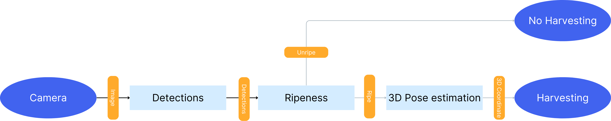

  <picture>
    
  </picture>

  

  
  
  
  

  

<h1 align="center">Exploring automated bell pepper harvesting</h1>

This research was conducted as part of the A-System minor at Fontys University of Applied Sciences. The project explores advancements in automated bell pepper detection, evaluating existing methods and investigating innovative techniques using AI technologies. The primary focus is on enhancing the precision and efficiency of bell pepper detection in automated harvesting systems.

## Connect with Me

## Table of Contents
- [Research Questions](#research-questions)
- [System Design Proposal](#system-design-proposal)
    - [Ripeness Determination](#ripeness-determination)
    - [Detections](#detections)
    - [3D Estimation](#3d-estimation)
    - [Pose Estimation](#pose-estimation)
- [Conclusion](#conclusion)
- [References](#references)

## Research Questions
For my research i have created questions which will be answered inside my report, there is one main questions which is supported by 7 sub research questions to get a better understanding and coverage on the topic.

Main Research Question:
1. How can the integration of AI technologies in automated systems advance the detection of bell pepper peduncles, thereby reducing manual labor in bell pepper cultivation?

Sub Research Questions:
1. What current solutions are available for automated bell pepper picking, and what role does AI play in these systems?
2. What challenges do current automated systems encounter when attempting to detect the peduncles of bell peppers accurately?
3. How do AI technologies enhance the precision and efficiency of peduncle detection in automated bell pepper harvesting?
4. What types of AI models and algorithms have been successfully implemented or are proposed for agricultural applications similar to peduncle detection?
5. What are the technical requirements and limitations for integrating AI-based peduncle detection into existing automated harvesting systems?
6. How do environmental factors impact the performance of AI-based peduncle detection technologies in indoor agricultural settings?
7. What are the potential impacts of AI-enhanced peduncle detection on the overall productivity and sustainability of bell pepper harvesting?

All of these questions are answered inside my research report, for more information you can contact me [Email](mailto:koenvanwijlick@gmail.com)

# System Design Proposal
Next, we will examine the system design proposal. After addressing all the research questions and analyzing their answers, I have determined what I believe to be the optimal and most viable solution for future automated bell pepper harvesting. This design considers the conclusions drawn from the research and aims to implement a system that can be realistically developed and deployed.

## Detections
For the detections of the bell peppers I have tested multiple neural network frameworks and version to look at the difference inside there performance. The conclusion was drawn that YOLOv8 is currently the best performing model with the most documentation on how to fine tune this model. 

For more information on the detections of bell peppers view: [Classification](./Detectons/Readme.md)

## Ripeness

### Ripeness Classification
To determine the ripeness of the fruit, we use YOLOv8 models. The models are trained on a dataset split into ripe and unripe categories.

### Ripeness RGB
An alternative method based on the color analysis of bell peppers. This algorithm takes an image as an input based on the detections of the neural network and then looks at the pixels inside the detections to classify them as ripe or unripe.

For more information on the determination of the ripeness of the bellpepper view: [Classification](./Classify/Readme.md)

## 3D Pose Estimation
Placeholder for 3D estimation details and images.

## Conclusion
Summary of findings and potential impacts on automated bell pepper harvesting.
# References
- Agrist. (2024, March). Agrist. Retrieved from https://agrist.com/.
- Armstrong, P. (2024, March). Bloom’s taxonomy. Retrieved from https://cft.vanderbilt.edu/guides-sub-pages/blooms-taxonomy/.
- Barth, R. (2016). Synthetic and empirical capsicum annuum image dataset. Wageningen University & Research. Retrieved from https://data.4tu.nl/articles/dataset/Synthetic_and_Empirical_Capsicum_Annuum_Image_Dataset/12706703/1.
- Claus, S., et al. (2023). Pag-nerf: Towards fast and efficient end-to-end panoptic 3d representations for agricultural robotics. Retrieved from http://agrobotics.uni-bonn.de/sweet_pepper_dataset/.
- CropForLife. (2023, August). Long day plants. Medium. Retrieved from https://medium.com/@cropforlife.com/long-day-plants-aa5e21e5178f.
- Davis, H. (2024, March). X ray photos of flowers. Retrieved from https://www.digitalfieldguide.com/faqs/x-ray-photos-of-flowers.
- Mazo, V. (2019, May). 3d human pose estimation. Retrieved from https://victoriamazo.medium.com/3d-human-pose-estimation-ce1259979306.
- MIDOPT. (2024, April). Healthy crop. Midopt. Retrieved from https://midopt.com/healthy-crop/.
- Mihajlovic, I. (2019, April). Everything you ever wanted to know about computer vision. Retrieved from https://towardsdatascience.com/everything-you-ever-wanted-to-know-about-computer-vision-heres-a-look-why-it-s-so-awesome-e8a58dfb641e.
- Viviers, C. G., et al. (2024). Advancing 6-dof instrument pose estimation in variable x-ray imaging geometries. IEEE Transactions on Image Processing. doi: 10.1109/TIP.2024.3378469.
- Wageningen, U. (2018, December). Sweeper, the sweet pepper harvesting robot. Retrieved from http://www.sweeper-robot.eu/.
- Wall, H. (2023, September). Do plants need sleep? Natural Wonders. Retrieved from https://naturalwonders.substack.com/p/do-plants-need-to-sleep.
- Weber, H. (2023, February). Exploring the advantages of nir spectroscopy in agriculture: A comprehensive infographic. Felix instruments. Retrieved from https://felixinstruments.com/blog/exploring-the-advantages-of-nir-spectroscopy-in-agriculture-a-comprehensive-infographic/.