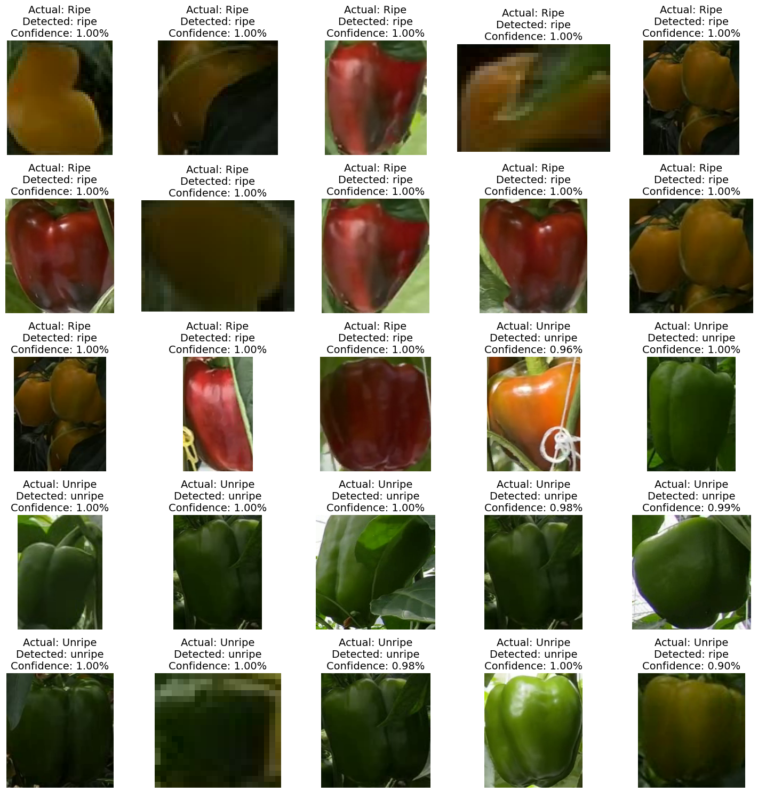
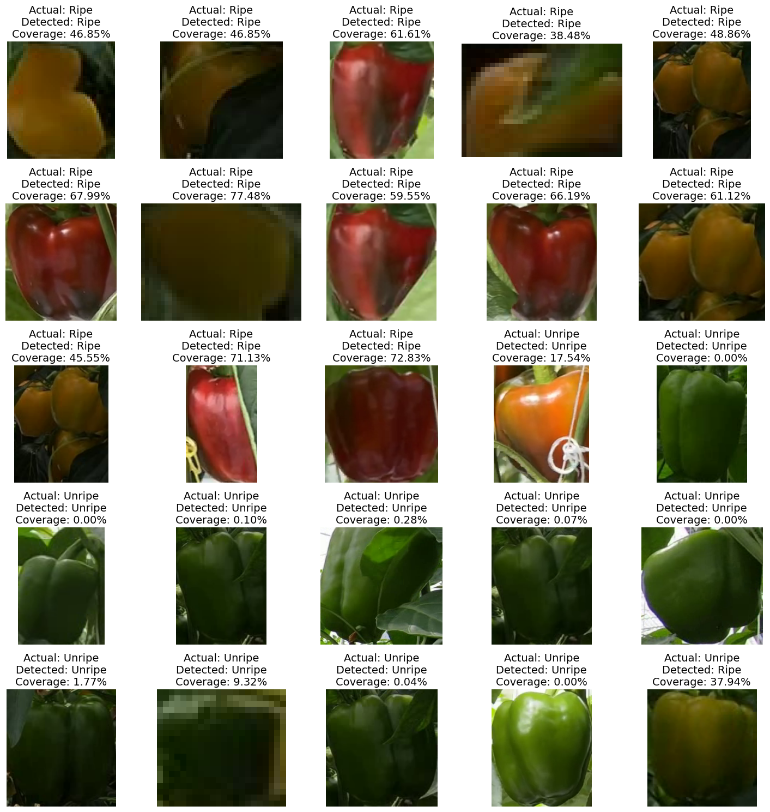

# Ripeness Determination Using YOLOv8 Models

## Overview
This project explores the use of YOLOv8 models for determining the ripeness of bell peppers. Two approaches are investigated:
1. **Ripeness Classification**: Using YOLOv8 models to classify bell peppers as ripe or unripe based on the segmentation model dataset.
2. **Ripeness RGB**: Developing an algorithm to assess ripeness based on RGB values of the fruit.

## Ripeness Classification
This approach leverages YOLOv8 models to determine fruit ripeness. The models are trained on a dataset split into two classes, ripe and unripe. Here are the details on model performance and setup:


### Model Performance
| Model        | Accuracy Top-1 | Accuracy Ripe | Accuracy Unripe |
|--------------|----------------|---------------|-----------------|
| YOLOv8n-cls  | 97.9%          | 97%           | 98%             |
| YOLOv8s-cls  | 97.6%          | 97%           | 98%             |
| YOLOv8m-cls  | 97.5%          | 96%           | 98%             |
| YOLOv8l-cls  | 97.7%          | 97%           | 98%             |
| YOLOv8x-cls  | 97.6%          | 96%           | 98%             |

Training Parameters:
- Batch size = 32
- Image size = 224
- Patience = 100


## Ripeness RGB
An alternative method based on color analysis of the bell peppers. The RGB approach uses a segmentation network to determine ripeness:

### Algorithm Performance
| Model        | Ripe Classification | Unripe Classification |
|--------------|---------------------|-----------------------|
| Set 1        | 97.16%              | 98.27%                |
| Set 2        | 99.39%              | 97.11%                |
| Set 3        | 95.96%              | 68.20%                |
| Set 4        | 100.00%             | 91.75%                |
| All Sets     | 98.35%              | 85.39%                |


## Usage Classifcation Scripts
Below is the explenation on how to use the provided code `RGB_Ripeness.py` with how to set it up and use it.
### Directory Structure

Organize your images in the following structure:

```
base_dir/
├── ripe/
│   ├── image1.jpg
│   ├── image2.jpg
│   └── ...
└── unripe/
    ├── image1.jpg
    ├── image2.jpg
    └── ...
```

### Running the Script for RGB Classifcation

1. Place your images in the `ripe` and `unripe` directories inside the `base_dir`.

2. Run the script with the following command:

```bash
python RGB_Ripeness.py --base_dir base_dir --save_dir save_dir
```

- `--base_dir` is the directory containing the `ripe` and `unripe` subdirectories.
- `--save_dir` is the directory where the output images and results will be saved.

### Running the Script for NN Classifcation

1. Place your images in the `ripe` and `unripe` directories inside the `base_dir`.

2. Run the script with the following command:

```bash
python NN_Ripeness.py --input_dir base_dir --ClassifyModel ClassBest.pt --output_dir output_dir
```

- `--input_dir` is the base directory containing the `ripe` and `unripe` subdirectories.
- `--ClassifyModel` is the path to the classification model.
- `--output_dir` is the directory where the output images and results will be saved.

## Explanation

### Functions RGB

- `calculate_ripeness(image_path)`: Calculates the ripeness of a fruit in an image.
- `adjust_gamma(image, gamma)`: Adjusts the gamma of an image.
- `process_directory(directory, actual_status)`: Processes all images in a directory and returns the results.
- `plot_and_save_results(base_dir, save_dir, fig_size, font_size)`: Plots and saves the results of the classification.

### Funtions NN

- `classify_image(image_path, classification_model)`: Classifies an image using the classification model.
- `process_directory(directory, actual_status, classification_model, output_dir)`: Processes all images in a directory and returns the results.
- `plot_and_save_results(base_dir, output_dir, fig_size, font_size)`: Plots and saves the results of the classification.
## Conclusion
While the classification model provides robust results across varying lighting conditions, the RGB method achieves perfect results under consistent lighting. The comparison highlights the strengths and limitations of each approach, guiding future enhancements and implementations.

---
For more details, please refer to the specific sections and tables within the project documentation.
